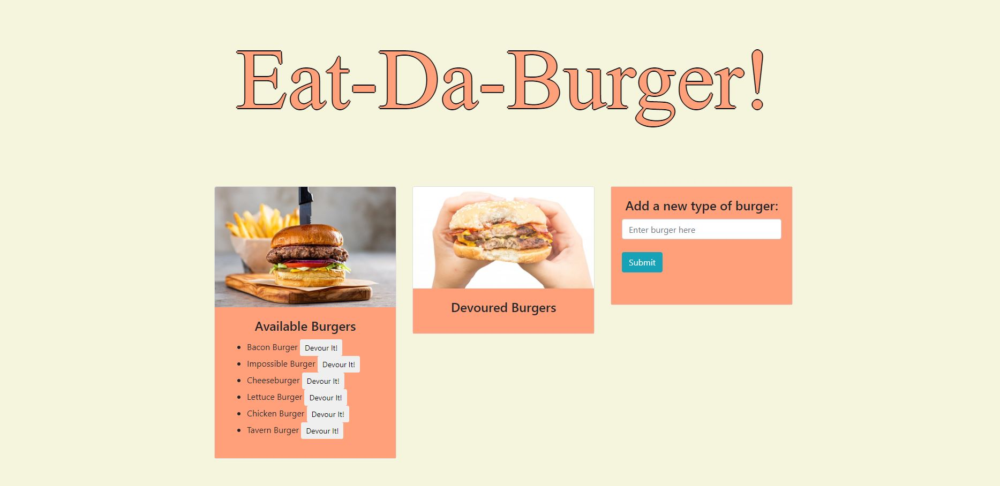

# Eat Da Burger
## Description
  This application allows users to add burgers that they would like to eat while also allowing them to check off the burger once eatened. 
## Table of Contents
1.[Usage](#Usage)

2.[Contribution](#Contribution)

3.[Questions](#Questions)

Image of the application

## Istallation Requirements
    npm express
    npm mysql
    npm express-handlebars
## Usage
    Users who want to keep track of which type of burgers they have eaten
## License

## Contribution
    Feel free to contact Ray's GitHub
## Heroku Deployed Link
   https://young-woodland-72010.herokuapp.com/
## Questions
If you have any questions, please contact my GitHub(https://github.com/rnguyen7388) or send me an email at rnguyen7388@gmail.com
